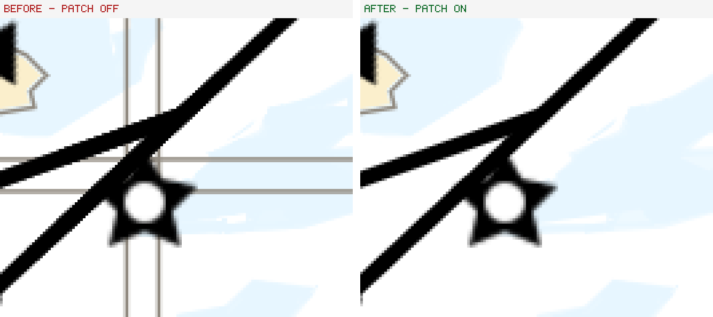
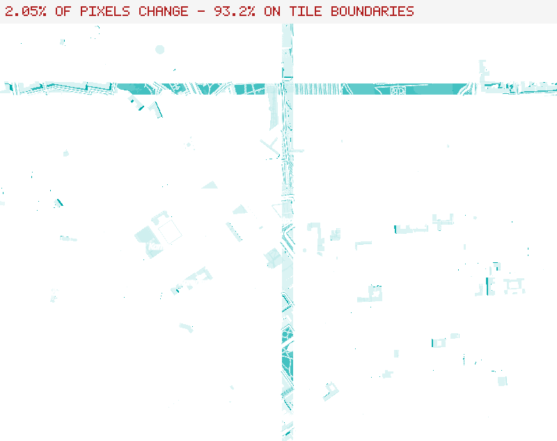

# The stencil buffer is never attached on the iOS Simulator — upstream MapLibre defect

**Status: patched locally, NOT yet reported upstream.** See
[Opening the upstream PR](#opening-the-upstream-pr) — that is the outstanding work.

Found 2026-08-01 while running a nautical-chart consumer app (Carta Polaris) against
this plugin on an iPhone 17 Pro Simulator. Every tile boundary draws as a **pair** of
grey lines straddling the seam. Clean on a physical iPhone, clean on macOS.

---

## The defect

`mtl::HeadlessBackend` asks for an offscreen texture with depth **and** stencil:

```cpp
// platform/default/src/mbgl/mtl/headless_backend.cpp:22
offscreenTexture = context.createOffscreenTexture(
    size, gfx::TextureChannelDataType::UnsignedByte, true, true);
//                                                   ^depth ^stencil
```

`mtl::OffscreenTextureResource` builds the stencil texture inside a simulator guard —
**deliberately**, because Metal requires a pipeline's depth and stencil attachment
formats to match, which is exactly why the *depth* texture is allocated as the
combined `PixelFormatDepth32Float_Stencil8` there
(`Texture2D::getMetalPixelFormat`, `src/mbgl/mtl/texture2d.cpp:99`):

```cpp
// src/mbgl/mtl/offscreen_texture.cpp:43
// On iOS simulator, the depth target is PixelFormatDepth32Float_Stencil8
#if !TARGET_OS_SIMULATOR
    if (stencil) { stencilTexture = context.createTexture2D(); /* … */ }
#endif
```

The comment states the intent. But `bind()` only ever populates the stencil
attachment from `stencilTexture`, which does not exist on the Simulator — so those
combined stencil bits are **never attached**, and the attachment's texture stays nil:

```cpp
// src/mbgl/mtl/offscreen_texture.cpp:78
if (stencilTexture) {                                  // nil on the Simulator
    stencilTexture->create();
    if (auto* stencilTarget = renderPassDescriptor->stencilAttachment()) {
        stencilTarget->setTexture(/* … */);
    }
}
```

`Context::makeDepthStencilState` then guards on exactly that, and silently produces
states with **no stencil descriptor at all**:

```cpp
// src/mbgl/mtl/context.cpp:616
if (auto* stencilTarget = rpd->stencilAttachment()) {
    if (stencilTarget->texture()) {                    // false on the Simulator
        applyStencilMode(stencilMode, stencilDescriptor.get());
        depthStencilDescriptor->setFrontFaceStencil(stencilDescriptor.get());
        depthStencilDescriptor->setBackFaceStencil(stencilDescriptor.get());
    }
}
```

**Every stencil test therefore passes.** `renderTileClippingMasks` writes a mask that
nothing tests against, so each tile draws its full **buffered** geometry over its
neighbours. Same-colour fills hide it completely; any geometry lying along the
tile-clip edge — a `fill-outline-color`, a polygon boundary — is drawn on *both*
sides of every boundary.

This affects every consumer rendering through the offscreen Metal path on the
Simulator, not just this plugin. It is silent: no Metal validation error, no log.

## Evidence



Identical camera, identical tile, iPhone 17 Pro Simulator (iOS 26.4), 5x crop. The
only difference between the two builds is the patch below.

**This is the figure that localises the bug:**



Rendered on **macOS**, where the artifact does not normally occur, by forcing both
simulator `#if`s on and diffing against the correct frame. The change is not diffuse
— it collapses onto the tile grid. `1-before-unpatched.png` and
`2-after-patched.png` are the two halves of the side-by-side, for attaching
separately.

### Measured

Reported frame, iPhone 17 Pro Simulator at DPR 3, measured off the pixels rather than
eyeballed:

| | value |
| --- | --- |
| line pair spacing | **13.48 px**, identical in both axes and at every band sampled |
| position | symmetric at **±6.74 px** about the boundary |
| profile | hard-edged on the OUTSIDE, antialiased on the INSIDE |
| fill between the pair | **bit-identical** to the fill outside it |
| tile pitch | ~1739 px |

That geometry is what rules out the alternatives. It is not a duplicated scene (a
diagonal coastline in the same frame is drawn once), not a line casing (it appears on
tile boundaries, not on features), and not a rasterisation phase effect (it is
constant in width and colour along a line that sweeps through several pixel columns).
It is two tiles each drawing their clip-buffer overhang into the other.

Controlled A/B on the Simulator, same camera, patch off vs on, using a
continuity statistic (fraction of the frame a straight dark ridge spans):

| | vertical ridges | horizontal ridges |
| --- | --- | --- |
| patch off | x=142 & x=155 — a pair 13 px apart, each spanning **81 %** of frame height | y=1396 & y=1408 — a pair 12 px apart, spanning **85 %** of frame width |
| patch on | top ridge **0.09**, scattered across x=806…1159, no pair | pair **gone**; top ridge is content present in both builds |

Controlled A/B on macOS with both simulator `#if`s forced on, OpenFreeMap Liberty at
z14, 800x600, `pixelRatio` 1:

| build | vs the correct frame |
| --- | --- |
| simulator conditions, unfixed | **2.05 % of pixels differ**; **93.2 %** of them within 20 px of a tile boundary |
| simulator conditions + the fix | **0 pixels differ** (max channel delta 1) |
| macOS with the patch applied | **0 pixels differ** — the new branch is dead off-Simulator |

### Why it was misdiagnosed for six weeks

`docs/decision-log.md` (2026-06-19) recorded faint 1-px sim seams as "a simulator
Metal-translation quirk … no mbgl `mtl::HeadlessBackend` patch needed". That bisect
was sound as far as it went — macOS headless clean, iOS on-screen clean, all four
present configurations identical, the Apple SDK clean at the same view — but it
stopped at *which tier* and never asked what the simulator `#if`s exclude. Same root
cause; a sea-chart style with polygon outlines simply makes it obvious where
demotiles only showed hairlines.

## The fix we carry

`packages/maplibre_flutter_core/patches/metal-simulator-stencil-attachment.patch`,
applied idempotently by `hook/build.dart` (marker `MBL_SIM_STENCIL_ATTACHMENT`), one
`else if` in `src/mbgl/mtl/offscreen_texture.cpp`.

When no separate stencil texture exists but one was requested, attach the depth
texture — which already carries stencil bits in the combined format the simulator
path allocates:

```cpp
} else if (stencilRequested && depthTexture) {
    if (auto* stencilTarget = renderPassDescriptor->stencilAttachment()) {
        stencilTarget->setTexture(
            static_cast<Texture2D*>(depthTexture.get())->getMetalTexture());
    }
}
```

This is what the existing comment already implies was intended. Reusing the depth
texture costs nothing; allocating a second combined-format texture would work too but
doubles the attachment memory for no benefit.

**Simulator-only by construction.** Everywhere else `stencilTexture` is non-null, so
the branch is unreachable — which the macOS row of the table above confirms
empirically (0 differing pixels).

`[[maybe_unused]] bool stencil` becomes a stored `stencilRequested` member, since the
constructor now needs it on every platform.

### Scope, stated honestly

- The fix restores stencil for the **offscreen** Metal renderable only
  (`mtl::OffscreenTexture`). On-screen `MLNMapView` was never affected — it does not
  go through this class, which is why the Apple SDK looked clean during the original
  bisect.
- `defined(__x86_64__)` selects the same combined format in `texture2d.cpp` but
  `offscreen_texture.cpp` guards only on `TARGET_OS_SIMULATOR`, so an x86-64 macOS
  build takes the normal path. Untested there — we have no Intel Mac.
- Not tested on a physical device, because the branch cannot execute there.

### Tests

**None yet, and this is the gap in the upstream submission.** The defect only
manifests where `TARGET_OS_SIMULATOR` is set, so it cannot be reproduced by the
existing harness on macOS, and mbgl's render-test suite does not run on a Simulator.

What was used instead is a *forced* reproduction: setting both simulator `#if`s on
macOS makes the artifact appear and the fix remove it, pixel-exactly. That is a real
causal proof but it is a manual procedure, not a committed test. Two options for
upstream:

1. A unit test asserting `getRenderPassDescriptor()->stencilAttachment()->texture()`
   is non-null after `bind()` when the resource was constructed with `stencil=true` —
   cheap, platform-independent, and it fails today on the Simulator.
2. A render test gated to the Simulator arm, which needs CI that runs one.

Option 1 is the one worth writing; it is a direct assertion of the invariant that was
broken.

## Prior art

**No MapLibre issue found.** Searching the `maplibre` org for
`TARGET_OS_SIMULATOR stencil`, `stencilAttachment simulator` and
`Depth32Float_Stencil8` returns nothing describing this. The guard and the combined
format were introduced together, so the omission appears to have been there since the
Metal backend landed.

Worth noting for the upstream discussion: `Context::makeDepthStencilState`'s guard
carries a comment explaining that it exists to avoid a Metal validation error
("MTLDepthStencilDescriptor sets depth test but MTLRenderPassDescriptor has a nil
depthAttachment texture"). It is doing its job correctly — it is defending against a
nil attachment that should never have been nil. The bug is upstream of it, which is
why nothing warns.

## Opening the upstream PR

**TODO — not done yet.** One issue, one PR.

1. **Issue** on `maplibre/maplibre-native` — the mechanism above, with
   `3-side-by-side.png` and `4-macos-forced-sim-diff.png`. Lead with the fact that
   it is silent (no validation error) and that it makes the Simulator
   unrepresentative of a device, which is the practical cost: it trains developers to
   dismiss real rendering bugs as "just the Simulator".
2. **PR on `maplibre/maplibre-native`** — the patch plus the unit test in option 1
   above. Expect the maintainer question to be *"why not just create the stencil
   texture on the Simulator too?"*; the answer is that it would work but allocates a
   second full-size combined-format texture when the depth texture already carries
   the bits, and the existing comment shows sharing was the original intent. Say so
   up front.

Unlike the text-centring patch, there is **no gl-js mirror** — this is specific to
the Metal backend's offscreen renderable and has no analogue on the web.

Reproduction, if wanted upstream: set `#if !TARGET_OS_SIMULATOR` to `#if 0` in
`offscreen_texture.cpp` and `#if TARGET_OS_SIMULATOR || defined(__x86_64__)` to
`#if 1` in `texture2d.cpp`, then render any style with a `fill-outline-color` through
a headless Metal backend on macOS. The seams appear on every tile boundary.
