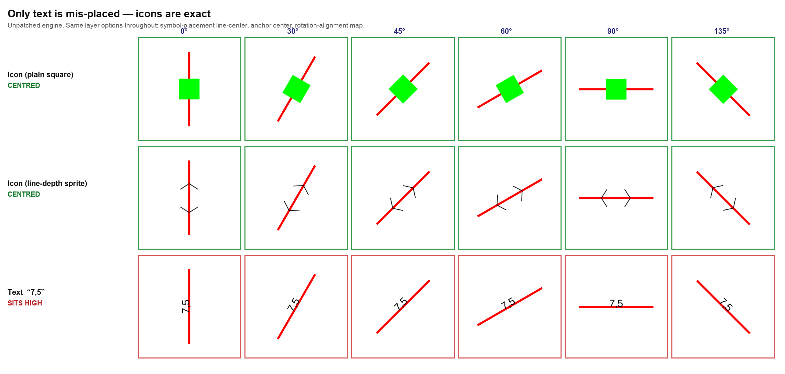
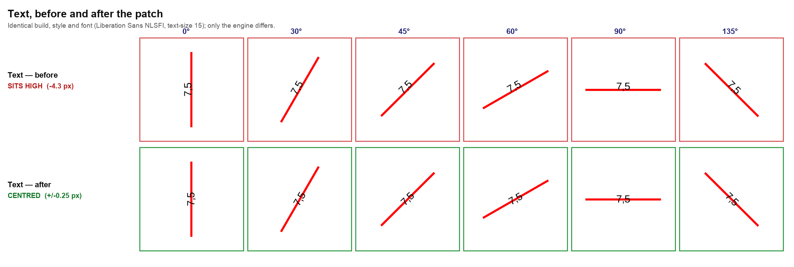
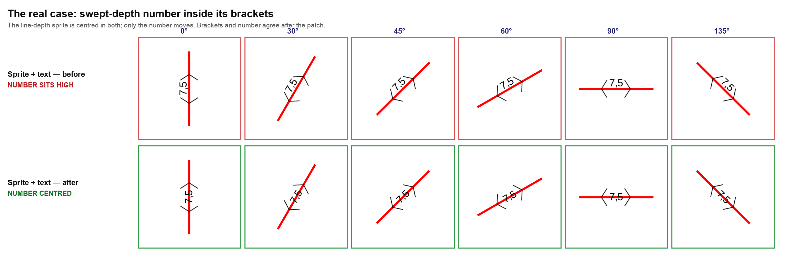

# Centre-anchored text is not centred — upstream MapLibre defect

**Status: patched locally, NOT yet reported upstream.** See
[Opening the upstream PRs](#opening-the-upstream-prs) — that is the outstanding work.

Found 2026-07-31 while building a nautical-chart consumer app (Carta Polaris) against
this plugin. The chart draws swept-depth numbers along fairway lines with
`symbol-placement: line-center` + `text-anchor: center`; they should straddle the
line and instead sit visibly above it.

---

## The defect

Both MapLibre engines position text vertically from a **hardcoded constant**
instead of the font's real baseline metrics:

| engine | file | constant |
| --- | --- | --- |
| maplibre-native | `include/mbgl/text/glyph.hpp` | `Shaping::yOffset = -17` |
| maplibre-gl-js | `src/symbol/shaping.ts` | `SHAPING_DEFAULT_OFFSET = -17` |

`ONE_EM` is 24, so it is a fixed −0.708 em baseline assumption — calibrated by
Mapbox against DIN Pro years ago. mbgl's own declaration says it outright:

```cpp
// The y offset *should* be part of the font metadata.
static constexpr int32_t yOffset = -17;
```

Any font whose real metrics differ renders centre-anchored text off-centre. Because
both engines carry the same constant, **the web shows the identical defect** — this
is not a native-tier divergence.

## Evidence



**This is the figure that localises the bug.** Three symbol types, six line angles,
identical layer options in every row (`symbol-placement: line-center`,
`text-anchor`/`icon-anchor: center`, `text-rotation-alignment: map`). The plain icon
and the sprite icon land dead-centre; only text is displaced. So symbol *placement*
is exact and the fault is in shaping.





`1-before-unpatched.png`, `2-after-patched.png` and `3-side-by-side.png` are the
minimal five-angle demo screen, which is what to attach to the upstream issue.

### Measured

24 orientations at 15° increments, `Liberation Sans NLSFI`, `text-size: 15`.
Perpendicular ink extent relative to the line:

| | ink across the line | centred to |
| --- | --- | --- |
| before | −9.80 … +1.74 px | 4.03 px off |
| after | −5.75 … +5.73 px | 0.25 px (spread 0.46) |

The error is **uniform at every angle** — a constant bias, not an orientation bug.
Icons measured within 0.25 px with 0.29 px spread, unaffected either way.

### Not fixable from the style — both ruled out by measurement

- **`text-offset`** is applied in the glyph's own frame, which flips with the line's
  digitisation direction. At offset 0 every bearing reads −4.3 px; at −0.25 em the
  two halves split to −8.1 px and −0.6 px. Any value that centres one direction
  drives the other twice as far out.
- **`text-translate`** has no effect at all on line-placed labels. Requested shifts
  spanning 12.9 px produced differences under 0.3 px.

## The fix we carry

`packages/maplibre_flutter_core/patches/text-centre-anchor-on-ink.patch`, applied
idempotently by `hook/build.dart` (marker `MBL_TEXT_CENTRE_ON_INK`), one function in
`src/mbgl/text/shaping.cpp`.

Centre on the **shaped glyphs' actual ink extent** instead of the constant. The
glyphs already carry what is needed — the quad builder places each at
`y - metrics.top * scale` spanning `metrics.height * scale` — so `align()` can
measure the ink and centre that. Only centre anchors are touched; `top`/`bottom`
anchors mean "align this edge" and were already correct.

It needs no glyph-PBF format change and no tile-server change. That matters: the
server-side route (shipping ascender/descender in the PBF) has been blocked for
years on [mapbox/node-fontnik#160](https://github.com/mapbox/node-fontnik/pull/160),
unmerged since 2019.

### Known gap — must be closed before upstreaming

mbgl hardcodes the same assumption a **second** time, in
`src/mbgl/layout/symbol_layout.cpp`:

```cpp
// We don't actually load baseline data, but we assume an offset of ONE_EM - 17
const float baselineOffset = 7.0f;
```

used at eight sites for radial offsets and **collision boxes**. Our patch does not
touch it, so with collision enabled a corrected label's collision box sits ~4 px off
its ink. Not visible in the chart because those layers use
`text-allow-overlap: true`.

## Prior art

**No MapLibre issue exists** — searching the whole `maplibre` org for
`SHAPING_DEFAULT_OFFSET` and `yOffset baseline` returns zero results. All prior art
is Mapbox-era and still open:

- [mapbox/mapbox-gl-js#154](https://github.com/mapbox/mapbox-gl-js/issues/154)
  (open since 2013-10-24) — *"We currently hardcode the glyph height so that we place
  the line centrally on the line. We should somehow deduce the offset from the font
  metrics **(or the shaped text bbox?)**"*. That parenthetical is precisely our fix,
  proposed twelve years ago and never pursued.
- [mapbox/mapbox-gl-js#191](https://github.com/mapbox/mapbox-gl-js/issues/191)
  (open since 2013-11-14) — its thread names the symptom: *"Text along lines are often
  not vertically centered (quite noticeable if the line geometry is also visible, like
  with road labels along roads)."*
- [maplibre/font-maker#20](https://github.com/maplibre/font-maker/pull/20) explains
  where −17 came from, and that MapLibre's mitigation compensates **in the glyph
  generator** — which does nothing for PBFs produced by other tooling.

> **Licence hazard.** Mapbox fixed their own side in GL JS v2
> ([#8781](https://github.com/mapbox/mapbox-gl-js/pull/8781), merged 2021) — after the
> MapLibre fork and under a proprietary licence. **That diff was deliberately not
> consulted while writing our patch**, and must not be, as MapLibre's PR checklist
> requires confirming no Mapbox backports. Our implementation was derived only from
> the code in front of us.

## Opening the upstream PRs

**TODO — not done yet.** Two PRs, plus an issue.

1. **Issue** on `maplibre/maplibre-native` describing the defect, citing
   mapbox-gl-js#154 and #191 as prior art, with the demo screenshots here.
2. **PR on `maplibre/maplibre-native`** — our patch, plus the
   `symbol_layout.cpp` `baselineOffset` site above, plus tests. Expect the maintainer
   question to be *"does this change existing maps?"* — it does, for any font whose
   metrics differ from the −17 assumption. font-maker#20's thread shows that concern
   raised (wipfli: *"Is there a way to settle on one convention and then stick to
   it…?"*), so lead with it rather than wait to be asked.
3. **PR on `maplibre/maplibre-gl-js`** — the mirror lives at
   `carta-polaris/patches/maplibre-gl-js-text-centre-on-ink.patch`. It is written but
   **untested**; gl-js needs the render-test suite run before it is proposable.

Reproduction rig, if it is wanted upstream:
`carta-polaris/flutter-poc/lib/dev/baseline_demo.dart` (minimal, screenshot-ready),
`lib/dev/line_anchor_probe.dart` + `tool/measure_probe.py` (24 orientations, pixel
measurement with a self-test), and `make demo-off` / `make demo-on` for the A/B.
